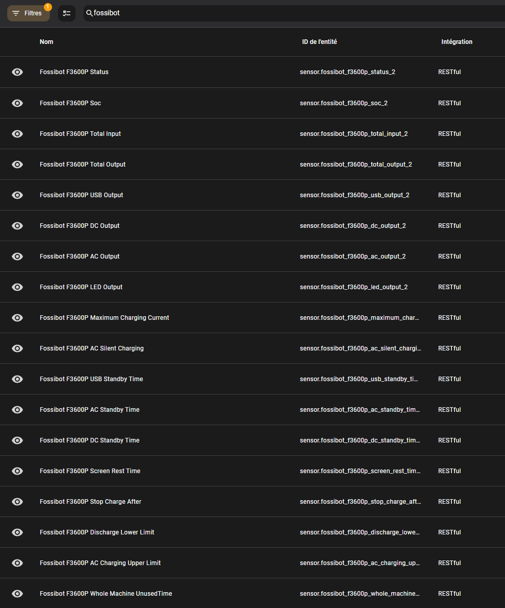
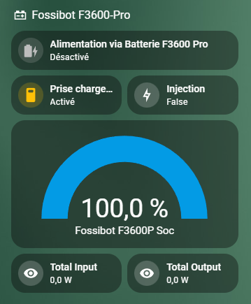

Sydpower API reverse engineering

**Concerned products:** Fossibot power stations using BrightEMS application. Currently tested with F2400 and F3600 Pro.

# Usage  

``node sydpower-run.js [USERNAME] [PASSWORD]``

# Disclaimer

I'm not responsible for anything that this software can cause.

Be extra carefull with registers, possibles values are shown in ``sydpower-registers.js``
  
For example, passing 0 to "whole machine unused time" will brick the device (I bricked one :D)
  

# Features

- login to your account to get the needed authentication tokens

- fetch your registered devices

- connect to mqtt and get devices informations realtime

- webserver is available to read status and trigger commands using routes:

	- view current status: ``http://localhost:3000/devices``  or ``http://localhost:3000/devices/:deviceId`` 
	
	- trigger command: ``http://localhost:3000/devices/:deviceId/:command`` or ``http://localhost:3000/devices/:deviceId/:command/:value``
	    Commands and available values are listed in file ``sydpower-registers.js`` 
		Example: ``REGEnableACOutput``

# Home Assistant

While waiting for a complete integration to be developped, you can run this nodejs application somewhere and fetch data with home assistant.

Use Home Assistant RESTful integration to do so.

A sample yaml is available: ``ha_rest.yaml``

You can then have values and commands on lovelace 

To call commands, just use in an action or automation one command, for example: ``rest_command.set_fossibot_xxxxx_enable_ac_output``
